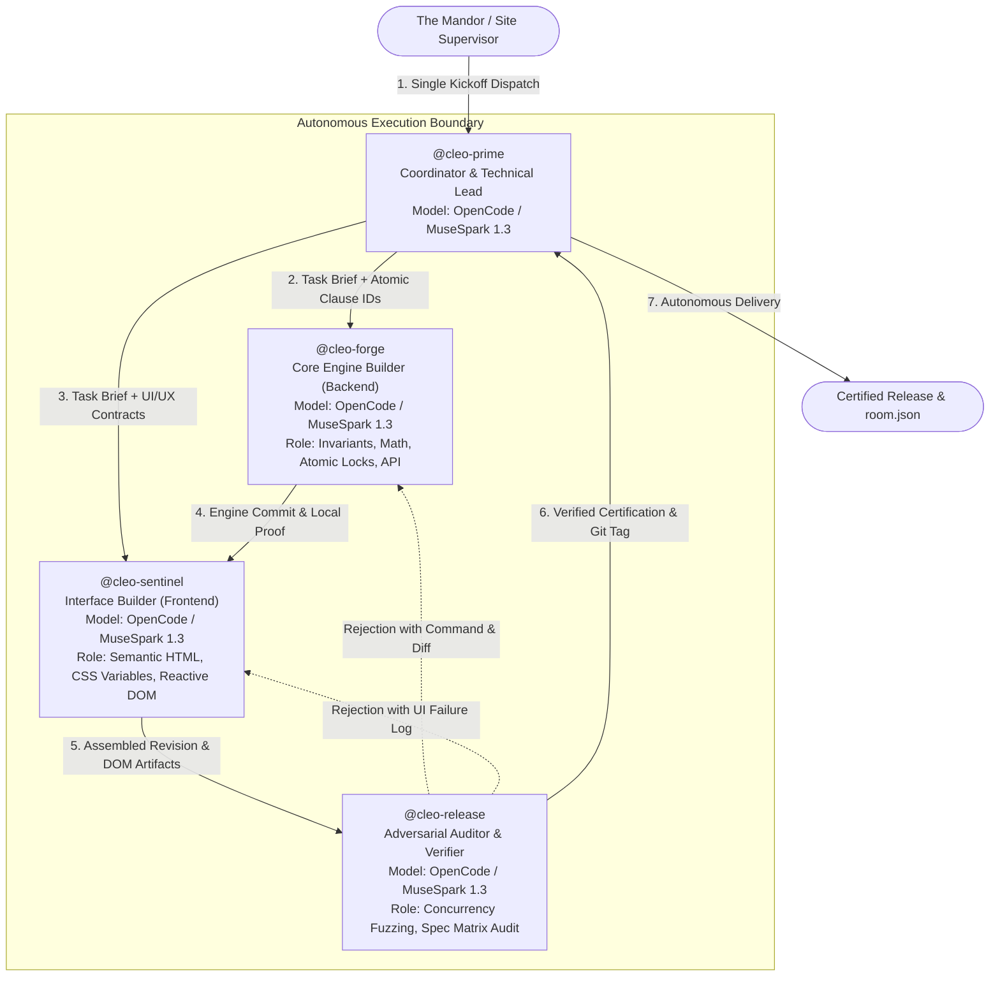

# Cleo Factory — Autonomous Software Manufacturing

> *"In a true Dark Factory, the human is not a programmer holding the wrench; the human is the **Mandor** (Factory Supervisor & Systems Architect) who designs the factory floor, establishes the quality gates, assigns specialized machine seats, and switches on the power."*

Autonomous software factory developed for the **WeAreDevelopers x BAND Hackathon: Dark Factory Challenge** (September 26 – October 5, 2026).

---

## 1. The Mandor Philosophy & Hackathon Thesis

The core premise of the Dark Factory competition is **Lights-Out Software Engineering**: building a system of autonomous coding agents capable of taking a specification, planning the execution, implementing the solution, and rigorously verifying the invariants **without a single human steering prompt, debugging hint, or mid-flight approval**.

### The Core Problem (Why 90% of Multi-Agent Systems Fail)
Empirical software engineering research on multi-agent trajectories (such as the **MAST taxonomy**, arXiv:2503.13657, evaluating 1,600+ multi-agent traces) demonstrates that autonomous coding agents rarely fail due to syntax or language inability. Instead, failures are organizational and behavioral:
* **41.77% of observed failures** fall into **Specification Issues** (misinterpretation, unstated assumptions, ignoring constraints).
* **37.60% of observed failures** stem from **Inter-Agent Misalignment** (referential handoffs, context drift, duplicate work).
* **20.63% of observed failures** stem from **Task Verification Collapse** (false-positive passes, shallow test coverage).
* The leading individual failure modes are **Step Repetition (17.14%)**, **Reasoning-Action Mismatch (13.98%)**, and **Failure to Request Clarification (11.65%)**.

In the Tablekeeper challenge, this danger is multiplied because the organizers ship only a fraction of the test suite (**only 11% of checks are shipped in Stage 3, and 21% in Stage 4**). Factories that rely on passive verification fall into the *"Green Illusion"* trap—passing sample tests while failing completely against hidden grading suites.

### Cleo's Design Answer
Cleo Factory does not treat agents as generalist coders chatting in an open room. It operates as a disciplined, role-based assembly line where:
1. **Work is decomposed into atomic, numbered clauses (`CLAUSE-XXX`)** at kickoff.
2. **Cognitive domains are strictly isolated** (Engine Invariants vs DOM/CSS Presentation).
3. **Verification is adversarial and independent** (probing edge cases never tested by shipped checks).
4. **All handoffs are self-contained evidence packets** (zero pointers, zero memory amnesia).

---

## 2. Factory Floor Architecture (4-Seat Decoupled Topology)



---

## 3. Seat Roles & Cognitive Division

To prevent **agent cognitive overload** (where an agent hallucinates or drops CSS contracts while writing complex interval trees), each seat owns a non-overlapping operational domain:

| Seat Handle | Runtime & Model | Architectural Ownership | What It Is Forbidden From Doing |
|---|---|---|---|
| **`@cleo-prime`** | OpenCode (`muse-spark-1.3`) | Factory coordination, requirements breakdown (`PLAN.md`), atomic clause ledger, task routing, and final delivery report. | **Never writes product code.** |
| **`@cleo-forge`** | OpenCode (`muse-spark-1.3`) | Domain invariants, zero-dependency Node.js engine, interval math, transactional concurrency serialization, and REST API routes. | **Never touches HTML templates or CSS stylesheets.** |
| **`@cleo-sentinel`** | OpenCode (`muse-spark-1.3`) | Modern presentation hierarchy, CSS design tokens, mobile-to-desktop responsiveness (375px–1280px), in-page reactive DOM updates, and preserving 100% of `data-testid` contracts. | **Never modifies backend database state or core transaction logic.** |
| **`@cleo-release`** | OpenCode (`muse-spark-1.3`) | Independent spec-clause ledger verification, adversarial race-condition probing (50+ simultaneous requests), clean container builds, and acceptance tagging (`accept-stage-N`). | **Never writes or patches application code.** |

---

## 4. The Four Pillars of Cleo Factory

### Pillar I: Spec-Clause Traceability Ledger
Rather than allowing agents to "code to the test", `@cleo-prime` extracts every requirement sentence into an immutable clause identifier (`CLAUSE-001`, `CLAUSE-002`, ...). Every Git commit from `@cleo-forge` and `@cleo-sentinel` must cite the clause it implements. Approval from `@cleo-release` requires a verifiable mapping: **Clause ID → Code Reference → Independent Probe → Pass Status**.

### Pillar II: Cognitive Decoupling (Engine vs UI/UX)
Prior iterations showed that a single developer agent produces either broken backend locks or unstyled 1990s HTML. Cleo isolates the visual presentation into `@cleo-sentinel`, enforcing:
* **Mutual Exclusivity:** Zero-state alerts (`no-slots`) and active slot grids (`availability-grid`) never collide in the DOM.
* **Reactive DOM Mutation:** User cancellations and booking submissions mutate the DOM in-place without requiring full browser reloads.
* **Responsive Tokens:** Native CSS variables for consistent typography, spacing, and contrast.

### Pillar III: Adversarial Verification (Closing the 89% Hidden Check Gap)
`@cleo-release` operates under the strict assumption that **shipped checks are incomplete**. It independently authors and executes:
1. **Burst Concurrency Probes:** Rapid parallel requests targeting identical microsecond intervals to guarantee atomic conflict rejection.
2. **Boundary & Timezone Stressors:** Validating IANA timezone offsets and leap boundaries against raw spec definitions.
3. **State Crash Recovery:** Testing state persistence and export/import fidelity across service restarts.

### Pillar IV: Clean Room Isolation (Gate 3 Compliance)
Cleo builds services with **zero runtime external npm dependencies**, using native Node.js primitives (`http`, `crypto`, `Intl`). All stages execute in hardened Linux Alpine containers with:
* `--network none` (strict runtime offline isolation).
* 2 vCPU and 2 GiB memory constraints.
* Sub-second startup latency.

---

## 5. Repository Structure & Verification

```text
cleo-tablekeeper/
  README.md            # You are here: architectural vision and operational thesis
  FACTORY.md           # Deep-dive design decisions, failure recovery, and trade-offs
  mandates/            # Generic role mandates (0 track vocabulary violations)
    cleo-prime.md      # Coordinator mandate
    cleo-forge.md      # Core engine builder mandate
    cleo-sentinel.md   # Presentation builder mandate
    cleo-release.md    # Adversarial verifier mandate
  room.json            # Full recorded session exported from Band Desktop
  stage-1/             # Complete buildable service: Idempotent JSON API & atomic moves
  stage-2/             # Stage 1 + Reactive browser product & availability grid
  stage-3/             # Stage 2 + Effective-dated dynamic policies & recurring series
  stage-4/             # Stage 3 + Deterministic emergency closure replanning
```

### Offline Pre-Flight Verification
Validate gate compliance and vocabulary cleanliness before evaluation:
```bash
python -m harness check . --track tablekeeper
```

### Running Containerized Stages
```bash
# Stage 1 isolated verification
python -m harness run --track tablekeeper --repo . --stage 1 --mode isolated

# Full factory pipeline verification across all stages
python -m harness run --track tablekeeper --repo . --all --mode isolated
```
